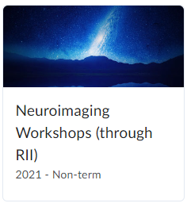

# Imaging (fMRI) data processing with High Performance Computing (HPC) cluster at the University of Arizona

Created and maintained by: Diheng Zhang ([diheng.zhang@gmail.com](mailto:diheng.zhang@gmail.com))

Docs created at: Oct 11th, 2022

Docs updated at: 2022-10-14 12:19:22 

Contributors:
- Andrea Coppola, M.A.
- Dianne Patterson, Ph.D.
- Teodora Stoica, Ph.D.

This is intended to be a documentation for starting fMRI data processing on HPC at UA. It mainly serves two purposes: 1. document the way I implement data (pre)processing for my doctoral dissertation and in the same time, 2. provide an example of one way to do that. This documentation is not intended to be exhaustive, however, external documentations will be provided at the beginning of each step for a deeper dive if needed.

## Starter resources

If you have no other previous experience with MRI data (pre-)processing, here are some external resources that can help you start:

- Dr. Saren H. Seeley's documentation on BIDS, fMRIPrep, MRIQC (local processing): [Read here](https://rpubs.com/sarenseeley/463941)
- [BIDS starter kit](https://bids-standard.github.io/bids-starter-kit/)
- fMRIPrep offical site: [Here](https://fmriprep.org/en/stable/)

Join Neuroimaging Workshops group (on D2L) for more imaging data processing workshops and tutorials. Usually meet on Mondays. Email Dianne Patterson ([dkp@arizona.edu](mailto:dkp@arizona.edu)) to be added to the D2L site.

## Converting your DICOM files to BIDS format

fMRIPrep is a *BIDS* app, meaning that it takes BIDS format data folders as input. BIDS stands for Brain Imaging Data Structure. It is recommended as a uniform structure to facilitate consistent collaboration between labs. See [BIDS starter kit](https://bids-standard.github.io/bids-starter-kit/) for more information.

Option 1: For data security purposes, it is recommended you convert your dataset with a secure local lab machine, defaces (deidentify) your dataset, and then transfer it to HPC. For documentation on how to do this locally, see Saren's note on BIDS [here](https://rpubs.com/sarenseeley/463941). For instruction about defacing your dataset locally, see [here](https://arizona.openclass.ai/resource/lesson-62252eb99cfeb41cbcde2cd8)

Option 2 (highly recommended): Or, you can convert and deface your DICOM file to BIDS format with an online platform [ezbids](https://brainlife.io/ezbids/) by Brainlife. ezbids is a HIPAA compliant online platform that require you upload your raw DICOM folder. Documentation of ezbids see [here](https://github.com/brainlife/ezbids).

*Note:* After you convert your DICOM files to BIDS format, we suggest that you use the [BIDS validator](https://bids-standard.github.io/bids-validator/) to check if the convertion is successful before you transfor your BIDS data to HPC.

## Starting with HPC@UA

### External resources
- Dr. Dianne Patterson's documentation on neural imaging on HPC@UA: [Neuroimaging-core documentation](https://neuroimaging-core-docs.readthedocs.io/en/latest/pages/hpc.html)

### Setting up your account on HPC

Here is the page for requesting an accout for HPC@UA: [HPC Account Creation](https://public.confluence.arizona.edu/display/UAHPC/Account+Creation)

If you are a PI, you will be registering a PI account, which will give you authority to sponsor individual or group access to HPC. For most of the graduate students, you will most likely requesting a sponsoered HPC account, which will be created upon approved from your sponsor (most likely your PI).

### Transferring data to HPC

*Note on data security:* HPC storages in general is not HIPAA compliant. It is recommended to convert your raw DICOM files to BIDS format, and then deface all imaging data before you transfer the data to HPC for further pre-processing.

- Globus:
Globus is the preferred way to transfer data from your local machine to HPC. Here is a 7 min video showing how to do that: [HPC 1b: Data Transfer](https://arizona.openclass.ai/resource/lesson-619ed67e898b4fb790c4e52a)  
  
You might also find this section of the Neuroimaging-core webpage helpful: [Neuroimaging-core/Transferring Files](https://neuroimaging-core-docs.readthedocs.io/en/latest/pages/hpc.html#transferring-files)

Step 1 - Register/Log in to [Globus](https://www.globus.org/): You can log in with your UA SSO credential. Just click "Log in" on the right upper corner and follow the instruction.

Step - 2 - Install Globus Connect Personal on your computer as an Endpoint: if your data is deidentified, you can use your personal laptop or any lab computer for this task. 

*Note for psychofizzer:* If you are a member for John Allen's Psychophysiology lab, just so you know that as of Oct 21, 2022, we don't have Globus Connect Personal installed on any of our term server. I have tried installing it but results in error.

Step - 2 (Alternative & recommended) - Use Google Drive for Globus: if you want to skip the Globus Connect Personal route, Globus also works with Google Drive. As an UA student your Google Drive account (same as your UA email address) comes with unlimited storage (but soon will be 15 GB). If your data is under 15 GB in total and has been deidentified, I recommend using Google Drive for Globus file transfer. I also recommend compressing your deidentified BIDS data into a single zip file before you move it to Google Drive for Globus, so that it saves you time and increase reliability of transferring. Documentation see [here](https://docs.globus.org/how-to/gcsv5.3/access-google-drive/). To connect your Google Drive to your Globus account, go to Collection tab and search "UA Google Drive" and go from there.
    
### A note on storage options

- HIPAA Box: This is recommanded if you want to do all your preprocessing on HPC. If you have access to a secure local machine for DICOM to BIDS convertion and defacing process (see below for more detail), you can skip this. [Link to request](https://uarizona.service-now.com/), See Home > Service Catalog > Teaching and Learning > Academic Technology > Box > Box Health Account Request.

Note: Each faculty at UA can request a 50 GB HIPAA Box account for free.

- Google Drive: This is recommanded if your dataset has already been deidentified. Google Drive connects well with your Globus account with just a little of configuration. See above for details.

### Accessing files on HPC

Option 1: You can access HPC with Open On Demand (OOD), but you need to request and gain access. See details [here](https://public.confluence.arizona.edu/display/UAHPC/Open+On+Demand). OOD provided a web-based GUI for HPC file management.

Option 2: Use ssh.

After you are on the UA VPN (see [here](https://uarizona.service-now.com/sp?id=sc_cat_item&sys_id=8ab35af01bb830507947edf1604bcb90) if you have not set it up), open a terminal and then type:

`$ssh [your netid]@hpc.arizona.edu`

Then you will be on the bastion host gateway.

*Note on decompressing your tar file:* If you compressed your dataset to tar before you transfer to HPC (which is recommended), you can click on "Open in terminal" in OOD and use this command to decompress your dataset:

`$tar -xvf [your dataset.tar]`

## fMRI data preprocessing with fMRIPrep on HPC

### Two ways of accessing HPC and running tasks

Option 1: Using a terminal and ssh

The old fashion way, and probably the most intuitive way if you have previous experience with command line and remote ssh login or work on other servers.

After you are on the UA VPN (see [here](https://uarizona.service-now.com/sp?id=sc_cat_item&sys_id=8ab35af01bb830507947edf1604bcb90) if you have not set it up), open a terminal and then type:

`$ssh [your netid]@hpc.arizona.edu`

Then you will be on the bastion host gateway.

Option 2: Using OOD

This is not much different from the option 1, other than giving you a little bit of GUI.

After you are on the UA VPN, open any browser (Firefox or Chrome is recommended), type in ood.hpc.arizona.edu, and then log in with your UA credential via SSO.

### Setting up your script for preprocessing with fMRIPrep on Singularity at HPC

In your Home Directory (type `$cd ~` if you are not sure), you should have a bin folder with several scripts (if you don’t let me know and I’ll show you how to copy it). 

One of the scripts runs fmriprep with singularity [runfmriprep.sh]. You will have to edit the .sh file with proper paths and account names.

*Note:* In your xdisk BIDS folder, make 2 blank directories called “derivatives” and “scratch”. In addition, *outside of your BIDS folder*, make a file called subjects.txt with just the numbers of the subjects you want processed. At the end of the list, press enter and leave an empty space (otherwise it won’t process your last subject).

From the OOD command line or your terminal, navigate to your data folder:

`$cd ~/xdisk/[group name]/[your folder]/[BIDS folder]`

*Note 1: I recommend visiting `/group/dkp/BIDS/` for an example of BIDS formatted folder structure. runfmriprep.sh takes a folder that is slightly different from the BIDS offical structure. There is a chance that your BIDS folder will pass the BIDS validator but still fail the runfmriprep.sh. Make sure that your BIDS folder structure is the same as /group/dkp/BIDS/*

*Note 2: Make sure that you have a license.txt file under your ~/ folder. You can cope it from ~/bin/*

the, run one subject with:

`$sbatch --export sub=[subject id] ~/bin/runfmriprep.sh`

or run all your subjects in the subjects.txt file with:

`$sbatchr runfmriprep.sh subjects.txt`

Go to the OOD/Jobs tab, Active jobs and keep refreshing it until you see that it started running.

**YOU’RE DONE!**