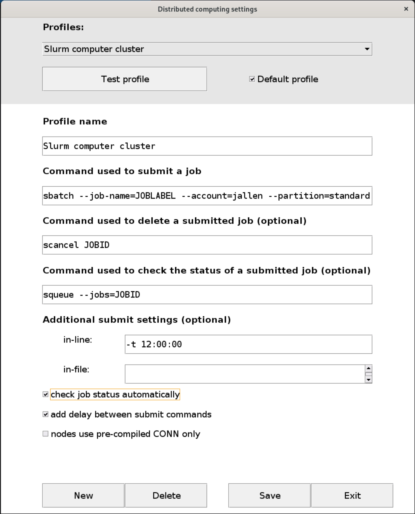
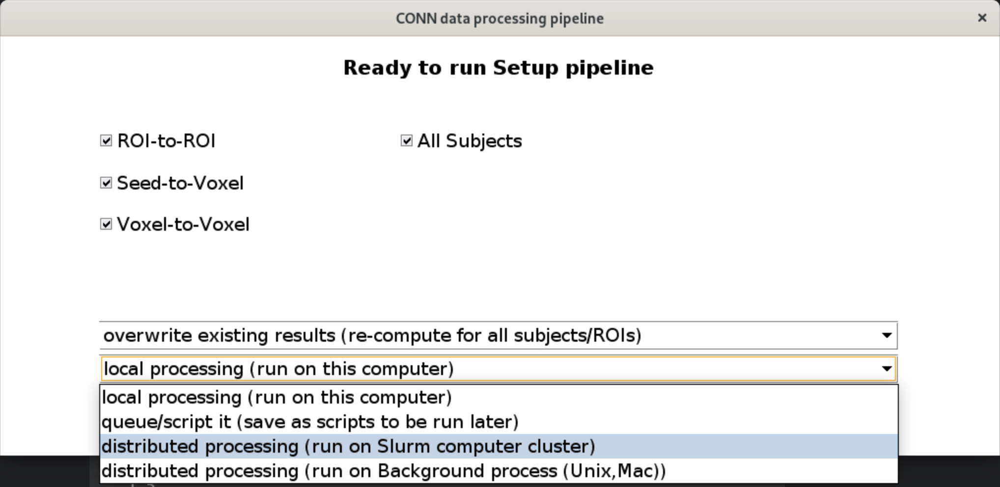

# Imaging (fMRI) data processing with High Performance Computing (HPC) cluster 
at the University of Arizona

Created and maintained by: Diheng Zhang 
([dihengzhang@arizona.edu](mailto:dihengzhang@arizona.edu))

Docs created at: Oct 11th, 2022

Docs updated at: 2025-04-14 12:19:22 

Contributors:

- Andrea Coppola, Ph.D.
- Dianne Patterson, Ph.D.
- Teodora Stoica, Ph.D.

This is intended to be a documentation for starting fMRI data processing on HPC 
at UA. It mainly serves two purposes: 

1. document the way I implement data (pre)processing for my doctoral
   dissertation and in the same time;

2. provide an example of one way to do that. 

This documentation is not intended to be  exhaustive, however, external
documentations will be provided at the beginning  of each step for a deeper dive
if needed.

## Starter resources

If you have no other previous experience with MRI data (pre-)processing, here are
some external resources that can help you start:

- Dr. Saren H. Seeley's documentation on BIDS, fMRIPrep, MRIQC (local processing): 
[Read here](https://rpubs.com/sarenseeley/463941)
- [BIDS starter kit](https://bids-standard.github.io/bids-starter-kit/)
- fMRIPrep offical site: [Here](https://fmriprep.org/en/stable/)

For documentations about HPC@UA, check out their awesome docs [here](https://hpcdocs.hpc.arizona.edu/)
and past workshops materials [here](https://hpcdocs.hpc.arizona.edu/events/workshop_materials/).

Join Neuroimaging Workshops group (on D2L) for more imaging data processing 
workshops and tutorials. Usually meet on Mondays. Email Dianne Patterson 
([dkp@arizona.edu](mailto:dkp@arizona.edu)) to be added to the D2L site.


## Converting your DICOM files to BIDS format

fMRIPrep is a *BIDS* app, meaning that it takes BIDS format data folders 
as input. BIDS stands for Brain Imaging Data Structure. It is recommended as 
a uniform structure to facilitate consistent collaboration between labs. See 
[BIDS starter kit](https://bids-standard.github.io/bids-starter-kit/) for more information.

Option 1: For data security purposes, it is recommended you convert your dataset 
with a secure local lab machine, defaces (deidentify) your dataset, and then 
transfer it to HPC. For documentation on how to do this locally, see Saren's note 
on BIDS [here](https://rpubs.com/sarenseeley/463941). For instruction about 
defacing your dataset locally, see [here](https://arizona.openclass.ai/resource/lesson-62252eb99cfeb41cbcde2cd8)

Option 2 (highly recommended): Or, you can convert and deface your DICOM file to 
BIDS format with an online platform [ezbids](https://brainlife.io/ezbids/) by Brainlife. 
ezbids is a HIPAA compliant online platform that require you upload your raw DICOM folder. 
Documentation of ezbids see [here](https://github.com/brainlife/ezbids).

*Note:* After you convert your DICOM files to BIDS format, we suggest that you use 
the [BIDS validator](https://bids-standard.github.io/bids-validator/) to check 
if the convertion is successful before you transfor your BIDS data to HPC.

### DICOM raw data folder structure

To save processing time and prevent file detection error on ezbids.io, it is 
recommended that you only upload the scans that you need (T1w, resting fMRI, etc.).

A typical DICOM dataset you copy from a scanner, may looks like this (specially 
for Siemens scanner):

```
Folder PATH listing for volume RAID Imaging
Volume serial number is 88E4-9172
P:MORENO_PSILOCYBIN_20190617_112411_379000\
+---10VOLS_FMRI_3MM_2_2_0011
+---10VOLS_FMRI_3MM_SINGLEBAND_0013
+---AAHEAD_SCOUT_0001
+---AAHEAD_SCOUT_MPR_COR_0003
+---AAHEAD_SCOUT_MPR_SAG_0002
+---AAHEAD_SCOUT_MPR_TRA_0004
+---ASL_3D_TRA_FAST_0019
+---AX_WMN_MPRAGE_0021
+---BZERO_VERIFY_P-A_0018
+---DTI_64_DIRS_GRAPPA2_0015
+---DTI_64_DIRS_GRAPPA2_TENSOR_0017
+---GRE_FIELD_MAPPING_0009
+---GRE_FIELD_MAPPING_0010
+---MOCOSERIES_0006
+---MOCOSERIES_0012
+---MOCOSERIES_0014
+---PERFUSION_WEIGHTED_0020
+---RSFMRI_3MM_2_2_0005
+---SAG_3D_FLAIR_0008
+---T1_MPRAGE_SAG_ISO_0007
+---T1_MPRAGE_SAG_ISO_S7_ND_0016
```

For the exact meaning of each folder name, please contact the technician at the 
scan center. Most likely, the `RSFMRI` folder is your resting fMRI data, 
`T1_MPRAGE` folder is your T1w structural scan (if you have more than one T1w 
scan folder, be sure to check the exact number of each folder. In the example 
above, the `T1_MORAGE_..._ND_0016` folder refers to the T1w scan _without 
distortion correction_, which is different from the standard T1w scan).

`GRE_FIELD_MAPPING` folders have two. The one with 84 image file (the first one) 
will become two images: magnitude1 and magnitude2. The fieldmap with 42 (the second 
one) will become the phasediff map. Ezbids can't recognize those correctly, and 
require you to assign the correct labels. You should get 3 images in the fmap directory 
from these two sets of dicoms. ezbids will allow you to indicate that these are 
intended for correcting the fMRI images, but you have to tell it to do that. 
The latest fmriprep will use them to do distortion correction even without the 
intendedfor (in other word IF you get the fieldmaps in the fmap directory, they 
should be used for correction. See this lesson on distortion correction: 
[here](https://arizona.openclass.ai/resource/lesson-6172f61631f96ff26f6eab1b)

## Starting with HPC@UA

### External resources
- Dr. Dianne Patterson's documentation on neural imaging on HPC@UA: [Neuroimaging-core 
documentation](https://neuroimaging-core-docs.readthedocs.io/en/latest/pages/hpc.html)

### Setting up your account on HPC

Here is the page for requesting an accout for HPC@UA: [HPC Account 
Creation](https://public.confluence.arizona.edu/display/UAHPC/Account+Creation)

If you are a PI, you will be registering a PI account, which will give you 
authority to sponsor individual or group access to HPC. For most of the graduate 
students, you will most likely requesting a sponsoered HPC account, which will be 
created upon approved from your sponsor (most likely your PI).

### Transferring data to HPC

*Note on data security:* HPC storages in general is not HIPAA compliant. It is 
recommended to convert your raw DICOM files to BIDS format, and then deface all 
imaging data before you transfer the data to HPC for further pre-processing.

- Globus:
Globus is the preferred way to transfer data from your local machine to HPC. 
Here is a 7 min video showing how to do that: [HPC 1b: Data Transfer](https://arizona.openclass.ai/resource/lesson-619ed67e898b4fb790c4e52a)  
  
You might also find this section of the Neuroimaging-core webpage helpful: 
[Neuroimaging-core/Transferring Files](https://neuroimaging-core-docs.readthedocs.io/en/latest/pages/hpc.html#transferring-files)

Step 1 - Register/Log in to [Globus](https://www.globus.org/): You can log in 
with your UA SSO credential. Just click "Log in" on the right upper corner and 
follow the instruction.

Step - 2 Use Google Drive for Globus: if you want 
to skip the Globus Connect Personal route, Globus also works with Google Drive. 
As an UA student your Google Drive account (same as your UA email address) comes 
with unlimited storage (but soon will be 15 GB). If your data is under 15 GB in 
total and has been deidentified, I recommend using Google Drive for Globus file 
transfer. I also recommend compressing your deidentified BIDS data into a single 
zip file before you move it to Google Drive for Globus, so that it saves you 
time and increase reliability of transferring. Documentation see 
[here](https://docs.globus.org/how-to/gcsv5.3/access-google-drive/). To 
connect your Google Drive to your Globus account, go to Collection tab and 
search "UA Google Drive" and go from there.
    
*Note on decompressing your tar file:* If you compressed your dataset to tar 
before you transfer to HPC (which is recommended), you can click on "Open in 
terminal" in OOD and use this command to decompress your dataset:

`$tar -xvf [your dataset.tar]`

See below for terminal access to the HPC.

### A note on storage options

- Google Drive: This is recommanded if your dataset has already been deidentified. 
Google Drive connects well with your Globus account with just a little of 
configuration. See above for details.

## fMRI data preprocessing with fMRIPrep on HPC

### Accessing files and running tasks on HPC

Option 1: You can access HPC with Open On Demand (OOD), but you need to request 
and gain access. See details [here](https://public.confluence.arizona.edu/display/UAHPC/Open+On+Demand). 
OOD provided a web-based GUI for HPC file management.

You can also click the 'Open in Terminal' button on the OOD page to open up a 
web-based command line window.

Option 2: Use ssh.

After you are on the UA VPN (see 
[here](https://uarizona.service-now.com/sp?id=sc_cat_item&sys_id=8ab35af01bb830507947edf1604bcb90) 
if you have not set it up), open a terminal and then type:

`$ssh [your netid]@hpc.arizona.edu`

Then you will be on the bastion host gateway.

### Setting up your script for preprocessing with fMRIPrep on Singularity at HPC

In your Home Directory (type `$cd ~` if you are not sure), you should have a 
bin folder with several scripts (if you don’t let me know and I’ll show you 
how to copy it). 

One of the scripts runs fmriprep with singularity [runfmriprep.sh]. You will 
have to edit the .sh file with proper paths and account names.

*Note:* In your xdisk BIDS folder, make 2 blank directories called “derivatives” 
and “scratch”. In addition, *outside of your BIDS folder*, make a file called 
subjects.txt with just the numbers of the subjects you want processed. At the 
end of the list, press enter and leave an empty space (otherwise it won’t 
process your last subject).

From the OOD command line or your terminal, navigate to your data folder:

`$cd ~/xdisk/[group name]/[your folder]/[BIDS folder]`

*Note 1:* I recommend visiting `/groups/dkp/BIDS/` for an example of BIDS 
formatted folder structure. runfmriprep.sh takes a folder that is slightly 
different from the BIDS offical structure. There is a chance that your BIDS 
folder will pass the BIDS validator but still fail the runfmriprep.sh. Make 
sure that your BIDS folder structure is the same as /group/dkp/BIDS/

*Note 2:* Make sure that you have a license.txt file under your ~/ folder. You 
can copy it from ~/bin/

the, run one subject with:

`$sbatch --export sub=[subject id] ~/bin/runfmriprep.sh`

or run all your subjects in the subjects.txt file with:

`$sbatchr runfmriprep.sh subjects.txt`

Go to the OOD/Jobs tab, Active jobs and keep refreshing it until you see that 
it started running.

**YOU’RE DONE!**

### Inspecting your results

Option 1: Use the Interactive Desktop on OOD. You can check the results on HPC 
via an interactive desktop.

Option 2: Compress and move the derivative folder back to your local computer 
via Globus.

### Array (parallel) jobs

You can setup an array script which allow you to run multiple jobs with one 
command. This is ideal when you have already tested out running one subject and 
finding the configuration that you need. You can see Dianne's documentation 
[here](https://neuroimaging-core-docs.readthedocs.io/en/latest/pages/hpc.html#running-lots-of-slurm-jobs).

The basic idea is to copy your edited runfmriprep.sh codes starting from ###run 
your code here#### to the end of the arrary.sh file and save it as a new, 
arrayed version of your originial runfmriprep.sh (see 
`/groups/jallen/dihengzhang/bin/arrary_runfmriprep.sh` as an example).

and then run all your subjects in the subjects.txt file with:

`$sbatchr ~/bin/arrary_runfmriprep.sh subjects.txt`

## Setting up and running CONN with Matlab on HPC

### Launching Matlab on HPC

UA HPC has a few common data analysis software installed and allow you to access 
them via GUI, including Matlab, Mathematica, Stata, VSCode, Jupyter Notebook 
and RStudio.

Go to Interactive Apps\Matlab\ and click Launch after you configure your node.

For further instruction on Matlab on HPC see Dianne's Matlab documentation 
[here](https://neuroimaging-core-docs.readthedocs.io/en/latest/pages/hpc.html#matlab-tools) 
and UA HPC's offical documentation 
[here](https://public.confluence.arizona.edu/display/UAHPC/Using+Matlab)

### CONN with Matlab on HPC

Once you fire up an interactive Matlab session, add the CONN path to your 
working path (it should be `/groups/dkp/neuroimaging/matlab`).

Then, just type `$conn` in your matlab command line and hit enter.

You can now use CONN just like you are on a local machine!

*Note*: It is not recommended that you add your derivatives folder to your mat 
lab path. I have tried it a couple times and it always froze the process. 
Instead, fire up your CONN first and then select your derivatives folder within 
CONN.

### Running your connectivity analysis with parallel processing

Setup your CONN setting correct to utilize parallel processing with Slurm

- Step 1: Open CONN, go to Tools > HPC Options > Configuration
- Step 2: See below for an example of the setup



Note:
Complete command inside the "Command used to submit a job"
`sbatch --job-name=JOBLABEL --account=jallen --partition=standard --error=STDERR --output=STDOUT OPTS SCRIPT`

Now you can easily parallel your processing on every step with CONN by selecting
_distributed processing (run on Slurm computer cluster)_ when you run your 
analysis.



## Setting up FSL on HPC

It is always recommanded to use FSL from an interactive desktop (See OOD 
documentation).

You can choose to install FSL on your HPC account. See FSL documentation for 
[installation instructions](https://fsl.fmrib.ox.ac.uk/fsl/docs/#/install/linux)

Or, you can use other's installed FSL, just need to make sure that you have
access to their folders and you configure your `~/.bashrc` file to include:

```
export FSLDIR=[path to installed FSL folder]
source ${FSLDIR}/etc/fslconf/fsl.sh
export PATH=$PATH:${FSLDIR}/bin
```

For example, you can use Dianne's version of FSL by putting these lines into
your `~/.bashrc`

```
export FSLDIR=/groups/dkp/neuroimaging/fsl
source ${FSLDIR}/etc/fslconf/fsl.sh
export PATH=$PATH:${FSLDIR}/bin
```

## Quality assurance analysis with MRIQC and QMTools

### Individual-level QC with MRIQC and fMRIPrep

### Group-level QC with MRIQC and QMTools

### Comparison to an aggregated sample with QMTools
    
